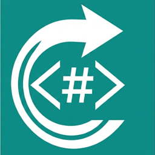

# Meet ReverseMarkdown

<p align="center">
  
</p>

[](https://github.com/mysticmind/reversemarkdown-net/actions/workflows/ci.yaml) [](https://www.nuget.org/packages/ReverseMarkdown/) [](https://mysticmind.github.io/reversemarkdown-net/)

ReverseMarkdown is a HTML to Markdown converter library in C#. v6 uses AngleSharp's HTML5-compliant parser and a Markdown DOM pipeline for reliable, performant conversion.

> **📖 Full documentation: [mysticmind.github.io/reversemarkdown-net](https://mysticmind.github.io/reversemarkdown-net/)**

> **Using v5.x?** See the [v5.x documentation](https://github.com/mysticmind/reversemarkdown-net/blob/5.x/README.md).

If you have used and benefitted from this library. Please feel free to sponsor me!<br>
<a href="https://github.com/sponsors/mysticmind" target="_blank"></a>

## Install

```bash
dotnet add package ReverseMarkdown
```

## Quick start

```cs
var converter = new ReverseMarkdown.Converter();

string html = "This a sample <strong>paragraph</strong> from <a href=\"http://test.com\">my site</a>";

string result = converter.Convert(html);
// This a sample **paragraph** from [my site](http://test.com)
```

With configuration and a flavor:

```cs
var config = new ReverseMarkdown.Config
{
    Flavor = MarkdownFlavor.GitHub,
    Formatting = { RemoveComments = true },
    Links = { SmartHref = true },
};

var converter = new ReverseMarkdown.Converter(config);
```

## Features

- **Seven output flavors** - Default, GitHub, CommonMark, Slack, Telegram, MultiMarkdown, and Pandoc, selected via the `Flavor` enum.
- **Spec-compliant round-trips** - CommonMark and GitHub Flavored Markdown round-trip at 100% against canonical cmark-gfm; MultiMarkdown and Pandoc verified against canonical pandoc.
- **Extensible** - custom readers (`IMdReader` + `[MarkdownReader]`), tag aliases, and a `Parse`/`Render` Markdown DOM for direct transformation.
- **Tables, links, and images** - nested tables and captions, smart href handling, URI-scheme whitelisting, and base64 image handling (include / skip / save to disk).
- **Broad framework support** - targets `netstandard2.0`, `net8.0`, `net9.0`, and `net10.0` (runs on .NET Framework 4.6.1+, .NET Core 2.0+, Mono, and Unity).

## Documentation

The full guide lives at **[mysticmind.github.io/reversemarkdown-net](https://mysticmind.github.io/reversemarkdown-net/)**:

- [Getting Started](https://mysticmind.github.io/reversemarkdown-net/guide/getting-started)
- [Flavors](https://mysticmind.github.io/reversemarkdown-net/flavors/)
- [Configuration reference](https://mysticmind.github.io/reversemarkdown-net/configuration)
- [Extending (custom readers, recipes)](https://mysticmind.github.io/reversemarkdown-net/extending)
- [Migrating from v5](https://mysticmind.github.io/reversemarkdown-net/migration)

## Acknowledgements

This library's initial implementation ideas from the Ruby based Html to Markdown converter [xijo/reverse_markdown](https://github.com/xijo/reverse_markdown).

## Copyright

Copyright © Babu Annamalai

## License

ReverseMarkdown is licensed under the [MIT License](https://github.com/mysticmind/reversemarkdown-net/blob/master/LICENSE).
